# Estudo de vendas e primeiro uso — TORQUE PERSONAL

30/09/2026 — meta de lançamento: 21/10/2026 — estudo atualizado após decisões comerciais e implementação local limitada.

A prioridade recomendada é concluir **compra → acesso confirmado → primeiro aluno → primeiro treino revisado e publicado**. Landing, HQ e indicações devem apoiar essa jornada. O preço decidido é **R$49,90/mês, cartão recorrente no site**; o app atende gestão/consulta. Pagar.me continua primeira opção e Asaas alternativa. **Raphael confirmou 40% de desconto na primeira mensalidade, 40% de comissão sobre o preço cheio, 10% de reserva operacional e 10% para o Torque.** A campanha permanece desligada até concluir gateway, integração e política para pagamento antes de completar o trial.

> Estado da rodada: 14 dias grátis e Assinar agora foram preservados. Preço, cadastro, assinatura web, recuperação do trial e a extensão do HQ geral existente foram implementados localmente. Catálogo, cupons e livro de comissões receberam persistência e testes. Gateway e primeiro treino continuam no planejamento; o onboarding não foi alterado. Consulte a [revisão técnica](VENDAS-INDICACOES-REVISAO-20260930.md). Nada foi publicado e nenhum pagamento real foi feito.

## 1. Base observada e limites da inspeção

Inspeção estática somente leitura da `main`, commit [`7019199b27d60068c581a8dd83c08a6df2d7f83d`](https://github.com/raphaelmarge/metodo-torque/commit/7019199b27d60068c581a8dd83c08a6df2d7f83d), de 29/09/2026. Foram lidos AGENTS, README, DESIGN, seções pertinentes de CLAUDE, entradas de vendas, login, primeiro uso, cobrança e HQ. Aplicada a skill Supabase para autorização e separação de dados. A árvore remota não contém `.agents/skills`; tampouco foram encontradas skills adicionais nos caminhos `.agents/skills` do workspace e do usuário examinados.

Não foram consultados registros de clientes/alunos, credenciais ou configuração real dos provedores. A inspeção inicial foi somente leitura; depois, o usuário autorizou as alterações locais descritas na revisão técnica, inclusive o HQ e a preparação de migração local. Não houve aplicação de migração em produção, publicação, contratação ou pagamento. O domínio público não pôde ser carregado na inspeção inicial: **isso limita a validação de produção, não comprova indisponibilidade do site**. Os testes locais da rodada anterior não homologam checkout, autenticação ou compras reais; a nova rodada HQ foi verificada localmente, sem homologação de produção. A análise paralela de dieta/treino com assistente fica fora deste estudo.

| Achado histórico na main inspecionada | Implicação para o lançamento |
|---|---|
| `personal-vendas.html` já oferece 14 dias grátis sem cartão e CTA para `personal.html`; mantém R$49. `torqueon.html` ainda contém R$49, referência a 7 dias e pagamento pelo WhatsApp. A página SEO `app-personal-trainer.html` também mantém R$49. | A revisão anterior estava parcialmente desatualizada: a landing evoluiu, mas preço, teste e compra continuam incoerentes entre rotas. Corrigir inclusive metadados, calculadora e CTA móvel. |
| O módulo de conta inicia na aba Entrar. O CTA de teste não passa uma intenção de cadastro. | O visitante novo pode cair numa tela com linguagem de cliente existente. Preservar intenção comercial até criar/recuperar a conta. |
| O guia inicial pergunta cobrança e Pix antes de cadastrar aluno; há opções de pular. Já existe outro guia de primeiro dia com aluno, ficha e app. | O problema não é ausência de guia: há trilhas concorrentes e configuração financeira antecipada. Unificar a próxima ação. |
| A camada atual de próxima ação já abre o treino com o aluno selecionado quando falta ficha. Sem aluno, porém, “Novo aluno” só navega até a área Alunos. As camadas posteriores preservam os guias anteriores. | Reaproveitar o encaminhamento contextual e fazer a ação de cadastro abrir o cadastro. Não é necessário criar outro guia. |
| Novo aluno mostra CPF/endereço e segue para contrato/venda, embora esses dados e o plano não sejam necessários para começar. Se informado e-mail, tenta criar/enviar acesso antes do primeiro treino. | Separar cadastro mínimo, prescrição e envio deliberado. Evitar conduzir o iniciante ao financeiro e entregar um app ainda sem treino. |
| Trial expirado reutiliza a tela de assinatura nativa; o botão chama RevenueCat. Sem plugin/chave, avisa que a compra chega na próxima atualização. | **Bloqueio P0:** o caminho web de recuperação não fecha a venda. É defeito funcional da jornada, não apenas texto de CTA. |
| SQL descreve trial de 14 dias + 3 de carência, bloqueio no dia 18. `ativa` não considera vencimento e `atrasada` permanece liberada na função observada. | Definir estados de cobrança/acesso consistentes, com carência finita e reconciliação. O código não comprova o estado do banco publicado. |
| HQ já possui clientes, saúde de uso e pagamentos manuais. Registro de pagamento e liberação de acesso são caminhos separados. | Estender HQ; não criar administração do zero nem tratar classificação manual como confirmação financeira. |
| Integrações `pagarme`/`pagamentos` cobram alunos dos profissionais. O split `comissao_pct` pertence a essa operação. | Não são a assinatura SaaS do Torque nem o programa de influenciadores. Reaproveitamento exige revisão, não simples troca de nome/preço. |

Evidências: [landing atual](https://github.com/raphaelmarge/metodo-torque/blob/7019199b27d60068c581a8dd83c08a6df2d7f83d/personal-vendas.html#L331), [login](https://github.com/raphaelmarge/metodo-torque/blob/7019199b27d60068c581a8dd83c08a6df2d7f83d/assets/modulo-conta.js#L10), [guia inicial](https://github.com/raphaelmarge/metodo-torque/blob/7019199b27d60068c581a8dd83c08a6df2d7f83d/personal.html#L1903), [novo aluno](https://github.com/raphaelmarge/metodo-torque/blob/7019199b27d60068c581a8dd83c08a6df2d7f83d/personal.html#L2098), [guia de primeiro dia](https://github.com/raphaelmarge/metodo-torque/blob/7019199b27d60068c581a8dd83c08a6df2d7f83d/personal.html#L22585), [trava e compra](https://github.com/raphaelmarge/metodo-torque/blob/7019199b27d60068c581a8dd83c08a6df2d7f83d/personal.html#L24158), [regra no SQL](https://github.com/raphaelmarge/metodo-torque/blob/7019199b27d60068c581a8dd83c08a6df2d7f83d/supabase-setup.sql#L3649), [HQ](https://github.com/raphaelmarge/metodo-torque/blob/7019199b27d60068c581a8dd83c08a6df2d7f83d/apps/hq.html).

As observações acima retratam o commit de referência. No trabalho local, preço e intenção de cadastro já foram corrigidos e o trial vencido web já aponta para o resumo de assinatura, ainda sem checkout. O HQ está sendo estendido na rota existente; não tratar essas mudanças locais como versão publicada.

## 2. Funil escolhido, uma única conta

**Escolha confirmada — preservar o teste e oferecer Assinar agora.** Mantém a oferta de 14 dias sem cartão e um caminho claro “Assinar agora — R$49,90/mês”. Ambos devem usar a mesma conta e o mesmo guia inicial. A data de cobrança e a elegibilidade para comissão quando a compra ocorrer antes de 14 dias continuam pendentes; o CTA não autoriza antecipá-las. O trial ganha sua página de assinatura e poderá converter sem repetir cadastro ou configuração quando o checkout estiver integrado.

**Alternativa não escolhida — compra como entrada principal.** Retirar ou reduzir o trial não faz parte da autorização atual. Não anunciar teste sem cartão numa página que força cartão na próxima etapa.

Desenho recomendado para quem escolheu comprar:

```mermaid
flowchart LR
  A[Landing: R$49,90/mês] --> B[Identificar ou criar conta]
  B --> C[Conferir oferta e indicação]
  C --> D[Checkout hospedado]
  D --> E[Confirmando pagamento]
  E --> F[Acesso confirmado]
  F --> G[Cadastrar primeiro aluno]
  G --> H[Montar e revisar treino]
  H --> I[Publicar e conferir app]
  I --> J[Compartilhar acesso]
```

**Landing.** Usar a identidade já existente e preservar demonstrações reais. Ordem: benefício para o personal → demonstração curta de aluno/treino/app → recursos comprovados → preço e recorrência → perguntas sobre cobrança/cancelamento → CTA. Mostrar “Sua assinatura do Torque” separada de “Receber dos seus alunos”. WhatsApp é apoio comercial, sem ser a passagem obrigatória para contratar. Não prometer disponibilidade de integração, IA ilimitada ou resultados ainda não validados. A revisão da landing deve ser cirúrgica; um novo desenho completo é prioridade inferior ao checkout.

**Identificação.** Novo visitante chega à aba Criar conta, com nome profissional, e-mail e senha; cliente existente entra e retoma. Não exigir razão social, logo, chave Pix, gateway próprio, plano dos alunos ou importação. Coletar documento/endereço de cobrança apenas quando efetivamente exigidos pelo provedor. Validar confirmação/recuperação de e-mail e continuidade em outro aparelho; evitar cobrar sem conseguir associar e recuperar a conta.

**Resumo de contratação.** R$49,90 por mês, cobrança recorrente no cartão, valor de hoje, próxima cobrança, política de cancelamento, identificação do fornecedor e links de termos/privacidade. Se contratação durante trial iniciar cobrança imediata, avisar explicitamente; eventual preservação dos dias restantes exige suporte homologado. Mostrar indicação reconhecida e permitir corrigir antes de pagar. Não aplicar desconto implícito.

**Checkout e retorno.** Pedido criado no servidor com plano/preço fixados ali e identificação da conta. Checkout hospedado recebe dados de cartão; Torque não guarda PAN/CVV. Retorno tem três estados claros: confirmando, aprovado, não concluído. “Confirmando” não manda pagar novamente. Recusa permite tentar outro cartão na mesma intenção de contratação; abandono permite retomar. Se perdeu a sessão, login recupera a contratação. Página de sucesso ou clique não libera acesso: o servidor confirma a cobrança.

**Minha assinatura no site.** Plano, situação, próxima renovação, cobrança anterior, atualização do cartão pelo caminho permitido do provedor, cancelamento da renovação, solicitação de reembolso e ajuda. Exibir confirmação e protocolo, inclusive quando a operação estiver pendente. Cancelar renovação preserva o período já pago, salvo reembolso/disputa ou outra regra claramente contratada.

**Trial vencido.** No site, uma saída de assinatura funcional, “Já paguei — verificar” e exportação. Preservar os dados e o último treino disponível ao aluno, conforme contratos existentes. Não reinterpretar falha de consulta como cancelamento; não usar liberação manual silenciosa para mascarar integração falha. Auditar eventuais pagantes de lojas antes de migrar qualquer comportamento.

## 3. Primeiro uso e painel do personal

Esta seção permanece **somente desenho de onboarding**, sem implementação autorizada nesta rodada. O resultado esperado é **publicar o primeiro treino revisado de um aluno e conseguir conferir o app correspondente**. Aproveitar os editores e a publicação existentes, sem reestruturar treino/dieta ou retirar as demais áreas do produto.

| Momento | Tela/ação principal | O que fica para depois |
|---|---|---|
| Primeiro acesso | “Vamos preparar seu primeiro treino”; aproveitar nome da conta, explicar progresso em três etapas. | Tour longo, logo, cor, instalação do app, financeiro e integração. |
| 1. Aluno | Nome e contexto mínimo necessário à prescrição; cadastro salvo imediatamente; CTA “Montar treino”. | CPF/endereço, cobrança, contratos e importação, salvo exigência específica da operação. |
| 2. Treino | Abrir o editor já com o aluno selecionado; montar do zero ou partir de modelo disponível, revisar exercícios/séries e salvar rascunho. | IA é opcional; nenhuma chave de IA ou gateway deve bloquear esse caminho. Não dispensar avaliação/informações necessárias ao julgamento do profissional. |
| 3. Publicação | Distinguir “rascunho salvo”, “publicação em andamento” e “publicado”; conferir a versão do aluno e então compartilhar. | Convite automático anterior à revisão; confundir prévia aberta com entrega confirmada. |
| Retorno | Continuar do aluno/rascunho em que parou; depois da primeira publicação, agenda e próxima ação normal. | Repetir onboarding ou exigir novas configurações já dispensadas. |

No Início, manter um único bloco de progresso, com uma próxima ação forte. Guia dispensado continua acessível. Preservar navegação móvel Início/Alunos/Agenda/Treinos/Menu, identidade do profissional e as áreas existentes. “Configurações recomendadas” entra como seção posterior, agrupada por finalidade: marca, receber dos alunos, comunicação, contratos e equipe. Cada integração explica custo e benefício apenas quando o profissional a solicita.

O checklist atual considera qualquer ficha existente como etapa concluída e grava “app visto” antes de abrir a nova janela. Esses indicadores não comprovam publicação nem acesso do aluno. A camada de próxima ação não os substitui. A futura medição precisa de confirmação real da publicação; abertura pelo aluno é um evento separado, quando observável. [Próxima ação atual](https://github.com/raphaelmarge/metodo-torque/blob/7019199b27d60068c581a8dd83c08a6df2d7f83d/assets/personal-fluxo.js#L66), [checklist atual](https://github.com/raphaelmarge/metodo-torque/blob/7019199b27d60068c581a8dd83c08a6df2d7f83d/personal.html#L22585).

Hoje há guias e ações de próximo treino que podem ser reaproveitados. Melhorar contexto e sequência é mais viável do que criar outro painel. No cadastro inicial, separar “Salvar aluno e montar treino” de “Configurar contrato/cobrança”; o acesso ao aluno deve ser enviado por ação consciente após a conferência do conteúdo, com resultado visível. Não mudar regras de clientes existentes incidentalmente.

## 4. Cobrança, acesso e administração

O desenho mínimo mantém três registros distintos: **assinatura/recebimentos**, **direito de acesso**, **recompensas**. Um cancelamento, uma classificação de CRM e uma disputa financeira não significam a mesma coisa.

**Pagar.me.** A referência atual permite link de assinatura com cartão e declara ausência de split nesse checkout. A API direta de split em recorrência possui outros requisitos e alcança cobranças recorrentes; não é a escolha simples para premiar só a primeira mensalidade. Proposta: checkout hospedado, plano de 4990 centavos e primeira cobrança de 2994 somente com campanha habilitada e cupom elegível, seguida de renovação a 4990; reconciliação interna e repasse posterior. Homologar desconto de um único ciclo, disponibilidade da conta, tarifas, liquidação, autenticação do webhook, prevenção de duplicação e propagação de referências antes de integrar. [Criar link](https://docs.pagar.me/reference/criar-link), [split em recorrência](https://docs.pagar.me/reference/split-na-recorr%C3%AAncia).

**Asaas.** Alternativa com checkout recorrente e cartão. `externalReference` auxilia vínculo; diferença entre pagamento confirmado e saldo recebido precisa ser refletida no serviço e no caixa. Escolher um provedor por lançamento, sem desenvolver os dois em paralelo. [Checkout recorrente](https://docs.asaas.com/docs/checkout-com-assinatura-recorrente), [referência de checkout](https://docs.asaas.com/reference/criar-novo-checkout), [eventos de cobrança](https://docs.asaas.com/docs/webhook-para-cobrancas).

**Eventos.** Persistir evento, validar origem, deduplicar, processar de forma recuperável e conciliar diariamente. Relacionar conta Torque, intenção, checkout, cliente do provedor, assinatura, fatura/ciclo e tentativas. O catálogo Pagar.me informa migração de `charge.chargedback` para `chargeback.received` até 30/09/2026; usar o contrato vigente homologado. Novas tentativas elegíveis podem gerar outro `charge_id` para a mesma fatura/pedido: não recompensar por evento ou tentativa isolada. [Eventos Pagar.me](https://docs.pagar.me/reference/eventos-de-webhook-1), [mudanças em pagamentos](https://docs.pagar.me/docs/pagamentos), [webhooks Pagar.me](https://docs.pagar.me/docs/webhooks), [webhooks Asaas](https://docs.asaas.com/docs/sobre-os-webhooks).

**Segurança indispensável.** Preço, proprietário da assinatura, promoção e indicação são validados no servidor. Impedir consultar/cancelar assinatura de outra conta. As estruturas novas exigem grants mínimos, RLS e testes negativos; influenciadores não recebem dados dos alunos. O HQ reaproveita a autorização administrativa existente, sem conceder novos administradores. Funções privilegiadas precisam de guarda administrativa, `search_path` restrito e revogação explícita de execução pública. Ingestão financeira fica exclusiva do serviço; `service_role` nunca entra no navegador. Arquivo de migração local não equivale a banco migrado. [Supabase: RLS](https://supabase.com/docs/guides/database/postgres/row-level-security), [Supabase: funções e privilégios](https://supabase.com/docs/guides/database/functions#function-privileges).

A inspeção de `pagarme` encontrou uma razão concreta para não reaproveitá-lo diretamente: criação aceita valor enviado pelo cliente, e consulta/cancelamento recebem ID de assinatura sem verificação explícita de vínculo com a academia antes de usar a chave global. É achado estático, sem exploração nem confirmação da função publicada. O caminho Asaas existente usa `billingType: UNDEFINED`, que tampouco comprova o cartão recorrente decidido para o SaaS. [Pagar.me existente](https://github.com/raphaelmarge/metodo-torque/blob/7019199b27d60068c581a8dd83c08a6df2d7f83d/supabase/functions/pagarme/index.ts#L223), [Asaas existente](https://github.com/raphaelmarge/metodo-torque/blob/7019199b27d60068c581a8dd83c08a6df2d7f83d/supabase/functions/pagamentos/index.ts#L316).

**HQ geral**, aproveitando `apps/hq.html`. A rodada local autorizada cobre catálogo de parceiros/cupons, extrato de comissões e registro administrativo de repasse manual. Compra/acesso, conciliação do gateway e métricas de primeiro uso abaixo continuam objetivos de integração; não estão prontos apenas porque a tela existe.

| Área | Conteúdo e próxima ação |
|---|---|
| Compra e acesso | Pagamentos confirmados sem acesso, checkout pendente, trial vencendo, falhas de renovação e eventos sem processamento. Priorizar exceções que impedem o uso. |
| Primeira utilização | Conta criada, primeiro aluno, rascunho, publicação e última atividade; filtro “pagou e não publicou”. Não expor treino clínico no painel comercial. |
| Cliente | Linha do tempo de conta, cobrança e acesso; origem da indicação; IDs técnicos em detalhe de suporte; nenhuma exposição de cartão. |
| Financeiro SaaS | Cobranças, estornos, disputas, valores confirmados/disponíveis e conciliação. Separar receita de saldo e comissões. |
| Parceiros | Ativo/pausado, link/código, versão de acordo, conversões atribuídas e pendências. |
| Apuração | Estados persistentes `pending`, `eligible`, `paid`, `suspended`, `reversed`; confirmação manual com referência, motivo, responsável e eventos de auditoria. Lotes automáticos ficam para depois. |

Separar perfis de suporte, financeiro e administração é uma evolução planejada; a rodada local reutiliza a autorização HQ existente. Concessões gratuitas/vitalícias exigem motivo, autor e duração quando aplicável. Manter log de quem aprovou, alterou e pagou. Se a equipe tiver uma pessoa, registrar passos distintos e revisar o fechamento, sem fingir dupla aprovação. Na main inspecionada, o formatador com `Math.round` perde centavos e certas consultas transformam falha em zero/lista vazia. A revisão local precisa confirmar a correção e distinguir carregamento, vazio e erro.

## 5. Indicação por link e código

Recomendação: piloto pequeno, por convite, com **link e código complementares**. A campanha confirmada dá 40% de desconto apenas na primeira mensalidade quando houver cupom validado e elegibilidade. Identificação por link, validação do cupom e ativação da campanha são etapas distintas; enquanto a campanha estiver desligada, nenhum desses sinais concede desconto ou comissão. Não anunciar o benefício como disponível antes da integração.

| Regra proposta | Funcionamento |
|---|---|
| Link | Domínio Torque + identificador público opaco do parceiro; UTMs identificam campanha, não são prova financeira. Não colocar dados pessoais na URL. |
| Código | Informado no cadastro/resumo de contratação. Código válido explicitamente escolhido prevalece sobre link. Mostrar parceiro reconhecido e benefício real, se houver. |
| Conflito de links | Último link elegível observado antes do cadastro; guardar evidência do escolhido. Após vínculo à conta, outra navegação anônima não troca automaticamente o parceiro. |
| Janela | Proposta: clique até 30 dias antes do cadastro e primeira cobrança até 30 dias após cadastro. Trial de 14 dias cabe nessa regra. Códigos seguem prazo próprio publicado. |
| Travamento | Congelar indicação na primeira intenção de checkout; retentativas mantêm a escolha. Correções posteriores exigem análise com justificativa, nunca sobrescrita silenciosa. |
| Sem associação | “Sem atribuição”; recuperar por código antes do checkout ou revisão documentada. Não inventar origem por proximidade de datas. |

Salvar a atribuição no servidor assim que houver conta identificada. Levar identificadores internos mínimos em referência/metadata do provedor e validar seu retorno. Não depender somente de cookies, e-mail ou nome do pagador para reconciliar compra. Navegador interno de rede social, bloqueios, modo privado e troca de aparelho podem perder a associação anônima. A janela comercial de 30 dias não garante armazenamento por 30 dias. Após login, a mesma conta pode conservar a indicação no servidor. Analytics serve ao funil, não à apuração financeira. [MDN: cookies](https://developer.mozilla.org/en-US/docs/Web/HTTP/Guides/Cookies), [WebKit: prevenção de rastreamento](https://webkit.org/tracking-prevention/), [GA4: User-ID](https://support.google.com/analytics/answer/9213390?hl=en).

Para outubro: gerar link/código no HQ, mostrar extrato restrito ou exportação revisada ao parceiro quando solicitado. Portal completo, autoinscrição, split e transferência automática ficam depois. Divulgação por influenciador deve revelar a relação comercial e seguir textos aprovados, sem prometer desconto, renda ou funcionalidade inexistente.

## 6. Recompensa, elegibilidade e fechamento

A regra anterior 50/50 foi substituída por **40/40/10/10, confirmada pelo usuário**. A comissão usa o **preço cheio de 4990 centavos**, uma única vez, vinculada à primeira mensalidade paga elegível. O caminho implementado considera o fim dos 14 dias de trial; pagamento antecipado continua em revisão de política. Cadastro, trial, cartão autorizado, cobrança pendente ou recusada não geram comissão. A reserva de 10% é uma alocação operacional: não é a taxa real do gateway nem cobertura garantida de todos os custos.

| Composição confirmada da primeira mensalidade elegível | Centavos |
|---|---:|
| Preço cheio | 4990 |
| Desconto da primeira mensalidade (40%) | 1996 |
| Primeira cobrança | 2994 |
| Comissão sobre preço cheio (40%) | 1996 |
| Reserva operacional (10%) | 499 |
| Parcela do Torque antes de outros custos (10%) | 499 |
| Segunda mensalidade em diante, sem nova comissão | 4990 |

**Campanha desligada:** o rateio já está confirmado; os bloqueios restantes são gateway, integração e elegibilidade de pagamento antes de 14 dias. A primeira cobrança elegível seria **R$29,94**, com comissão de **R$19,96**, reserva de **R$4,99** e parcela Torque de **R$4,99**; da segunda em diante, **R$49,90 sem nova comissão**. Valor fixo, crédito e bônus não são a regra do piloto. Primeira cobrança efetivamente paga em ciclo posterior a uma tentativa falha exige reconciliação e regra comercial; o núcleo local encaminha esses casos para revisão.

Apurar a margem real com as taxas contratadas, tributos e custo do serviço, evitando contar a reserva novamente como despesa. Os R$4,99 destinados ao Torque não são lucro garantido. Trial não gera comissão; mensalidade futura, upgrade e reativação não geram outra recompensa de aquisição.

**Elegibilidade proposta:** novo cliente pagante, parceiro aprovado, indicação válida, primeira cobrança confirmada, ausência de fraude/reembolso impeditivo. Uma recompensa por cliente econômico adquirido; múltiplas contas, faturas e retentativas não reiniciam o benefício. Usuário de trial pode ser elegível; antigo assinante que retorna não. Não remunerar autoindicação, recrutamento de outros parceiros, contas artificiais ou compras combinadas.

**Cancelamento/reembolso/disputa:** cancelar renovação sem devolver o primeiro pagamento não retira comissão válida. Estorno integral zera; parcial reduz proporcionalmente a comissão apurada, preservando o snapshot da base de preço cheio. Disputa aberta suspende; perda confirmada reverte; resolução favorável permite reavaliar. Se já houve repasse, criar ajuste vinculado ao original, compensável conforme termos aceitos; não apagar histórico. Prazos de retenção não eliminam chargebacks posteriores. Cancelar assinatura e estornar cobrança são operações distintas nos provedores. [Pagar.me: cancelamento](https://docs.pagar.me/reference/cancelar-assinatura-1), [Asaas: assinaturas](https://docs.asaas.com/docs/faq-assinaturas).

**Antifraude proporcional:** confirmar identidade e destino de pagamento do parceiro; revisar coincidências de titular, padrões anormais de contas/reembolsos e instrumentos repetidos quando legitimamente disponíveis. Não armazenar cartão nem usar IP compartilhado isoladamente como prova. Suspensão tem motivo e revisão; parceiro só recebe dados mínimos da conversão, sem CPF completo ou informações dos alunos.

**Apuração local implementada:** `pending` (aguardando apuração) → `eligible` (apto ao repasse) → `paid` (repasse manual registrado), com `suspended` e `reversed` para pendências e reversões. Alterações exigem versão esperada do registro (CAS), motivo e evento de auditoria para evitar sobrescrita concorrente. O HQ registra referência de um pagamento já realizado; não executa transferência nem confirma a cobrança do assinante. A transição para elegível depende dos fatos financeiros e da política; um clique não comprova liquidação. Proposta operacional ainda a fechar: observação de 30 dias, recebível disponível e fechamento mensal, sem exigir segunda mensalidade. Guardar snapshot comercial e arredondar em centavos.

Antes de pagar um lote: reconciliar provedor, cobranças e comissões; revisar exceções; fixar total e itens; aprovar; registrar referência/comprovante; impedir inclusão duplicada. No piloto, transferência manual após aprovação é suficiente. Nenhum repasse é solicitado neste estudo.

## 7. Contratação, privacidade e lojas

Preparar cancelamento e solicitação de reembolso no site, confirmação de recebimento e atendimento rastreável. O CDC art. 49 e o Decreto 7.962/2013 contêm regras sobre contratação a distância, informação e arrependimento. Como o produto é usado profissionalmente, validar o enquadramento e os termos concretos; não presumir automaticamente aplicação nem exclusão do CDC. Trial não deve ser apresentado como substituto de direitos do comprador. [CDC](https://www.planalto.gov.br/ccivil_03/leis/l8078compilado.htm), [Decreto 7.962](https://www.planalto.gov.br/ccivil_03/_ato2011-2014/2013/decreto/d7962.htm).

Definir finalidade, base legal, retenção e compartilhamento por categoria: conta/cobrança, indicação, analytics e marketing. Não classificar cookie de afiliado como essencial por conveniência. Onde o tratamento depende de consentimento, oferecer escolha e revogação; rejeição de marketing não impede compra. Código informado pelo usuário ajuda a recuperar atribuição, mas também exige transparência. [ANPD: guia de cookies](https://www.gov.br/anpd/pt-br/centrais-de-conteudo/materiais-educativos-e-publicacoes/guia-orientativo-cookies-e-protecao-de-dados-pessoais.pdf/@@display-file/file).

**Venda web + app exige validação de enquadramento.** Apple 3.1.3(f) prevê companion gratuito de ferramenta paga web, sem compra/chamada externa no app. Google admite consumo de acesso comprado fora, com restrições de encaminhamento e exceções específicas. Software para personal não se torna automaticamente serviço presencial ou venda empresarial isenta. Checkout em WebView/WhatsApp no app não resolve essa questão. Preservar direitos de eventuais assinantes de lojas e validar a ferramenta web efetiva e as notas de revisão. Não prometer aprovação até 21/10; lançamento web/PWA pode avançar sem depender da loja, após validação real do produto web. [Apple](https://developer.apple.com/app-store/review/guidelines/#other-purchase-methods), [Google Play](https://support.google.com/googleplay/android-developer/answer/10281818?hl=en).

## 8. Métricas e plano de três semanas

Não há baseline atual comprovado; os números abaixo são critérios de produto/aceite, não resultados existentes.

**Funil:** visita elegível → CTA → conta criada → checkout iniciado → primeira cobrança confirmada → acesso liberado → primeiro aluno → primeiro rascunho → primeira publicação. Medir cada conversão com denominador e período claros; separar caminho de trial, compra direta e parceiro. Demo não conta como ativação.

**Experiência:** tempo mediano e p90 entre pagamento e acesso; tempo de uso ativo até primeira publicação; abandono por etapa/campo; falhas de cadastro, confirmação, publicação e recuperação; chamados de “paguei e não entrou”. Primeiro treino publicado é distinto de ficha vazia, clique em publicar ou prévia aberta.

**Negócio:** novos pagantes, MRR da assinatura, renovação da primeira coorte, cancelamento voluntário e falha de cobrança, estornos/chargebacks, receita líquida após custos, CAC por canal e parceiro. Comissão em observação/aprovada/paga e vendas sem atribuição devem aparecer separadas. CAC só é calculado com custos registrados; não inferir LTV de três semanas.

| Prazo | Entrega planejada e responsável funcional | Critério para avançar |
|---|---|---|
| 30/09–03/10 | Produto/UX: consolidar o funil aprovado e mapear estados; financeiro: confirmar viabilidade Pagar.me e termos; engenharia: concluir HQ local e contrato de integração/identificação; responsável pelas lojas: avaliar companion. | Fluxo revisável, conta/produto do provedor viáveis e nenhuma dúvida sobre quem compra e qual acesso recebe. |
| 04–07/10 | Engenharia + UX: primeira cadeia completa de sandbox, incluindo assinatura e trial vencido; desenho do primeiro uso e eventos. | Conta → pagamento → acesso na mesma identidade; retorno/erro recuperável. Se Pagar.me bloqueado, decidir Asaas até 07/10. |
| 08–14/10 | Primeiro uso contextual, HQ de exceções, cancelamento/reembolso, atribuição e ledger mínimo. | Usuário chega ao primeiro treino sem configurar financeiro; permissões e deduplicação verificadas. |
| 15–20/10 | Piloto pequeno acompanhado, correções e ensaio de conciliação/lote; revisão de preço/copy e suporte. | Sem bloqueadores de compra/acesso/publicação; operação sabe resolver falhas. Parceiros entram só se cobrança estiver estável. |
| 21/10 | Lançamento condicionado aos critérios; ampliar tráfego gradualmente. | Jornada crítica funcional e observável, com responsável pelas exceções e recuperação documentada. |

**P0 antes de divulgar:** R$49,90 coerente; cadastro e checkout retomáveis; conta correta e acesso derivado de confirmação; saída funcional do trial vencido; primeiro treino sem setup financeiro; autorização por conta; cancelamento e pedido de reembolso; monitoramento e reconciliação; termos e privacidade adequados. Confirmar se há assinaturas existentes a preservar.

**P1, somente sem pressionar P0:** piloto de parceiros com código/link, regras versionadas e apuração manual; refinamento visual da landing e extrato básico.

**Depois do lançamento:** portal completo de influenciadores, autoinscrição, split/repasse automático, bônus complexos, comissões recorrentes, testes A/B e novo painel de BI. Atribuição básica pode entrar no lançamento; não anunciar programa remunerado antes de conseguir provar e apurar suas vendas.

**Cenários mínimos de aceite:** novo cliente, cliente existente, trial vencido, conta gratuita/vitalícia legítima; e-mail de cobrança diferente do login; checkout abandonado; clique duplicado; timeout sem segunda compra; cartão recusado; pagamento confirmado sem retorno ao site; webhook repetido/fora de ordem; acesso em outro aparelho; renovação/recusa/cancelamento/reembolso parcial e integral; disputa após repasse; link A + código B; sem cookie; duas contas do mesmo comprador; acesso negado ao financeiro de outra conta; rascunho preservado em falha de publicação. Simular o ciclo mensal quando sandbox permitir: três semanas não comprovam uma renovação natural de toda a coorte.

Proposta de avaliação de usabilidade: cinco personals novos em celular executam cadastro/compra de teste e primeiro treino sem intervenção. Registrar onde travam e corrigir os obstáculos recorrentes. “Até dez minutos de uso ativo para a primeira publicação” pode ser uma meta interna de desenho, não uma promessa comercial nem comprovação atual.

## 9. Decisões restantes

1. **Assinar agora durante trial:** preservar os 14 dias e cobrar depois (recomendado), ou cobrar imediatamente com regra explícita de elegibilidade e aviso do valor/data. A implementação não decide isso nem simula cobrança. O rateio 40/40/10/10 já está confirmado e não precisa ser perguntado novamente.
2. **Operação antes do piloto:** fechar janelas de atribuição/observação, calendário e responsáveis pelo repasse, além do tratamento da primeira cobrança paga em ciclo posterior. Proposta: observação de 30 dias, recebível disponível e fechamento mensal, sem depender de uma segunda mensalidade.

Disponibilidade comercial do gateway, integração de eventos e revisão das lojas continuam pendentes. O cronograma depende dessas validações. A implementação local cobre preço/entrada, resumo de assinatura e núcleo inativo; a nova rodada estende o HQ geral com catálogo, cupons, ledger e migração local. O contrato frontend/backend e os testes locais desta rodada foram concluídos. Checkout real e simplificação do primeiro treino continuam no plano. Nenhum merge, deploy, pagamento ou migração em produção foi realizado.

Regressões finais: o trial vencido web encaminha para a assinatura e preserva RevenueCat nativo, backup e reconsulta. O cache mt-v850 inclui o novo HQ e passou nos nove cenários locais de upgrade/offline. A rodada HQ passou em 15 grupos de interface, 29 testes da ponte e 28 verificações SQL. Concorrência entre sessões PostgreSQL, gateway, PostgREST e produção não foram homologados. A migração permanece local, com campanha inativa.

Fechamento desta rodada: o HQ geral recebeu cadastro de parceiros/cupons, livro de comissões, histórico e registro manual de repasse, com campanha OFF e migração local testada. Passaram 15 grupos de interface, 29 testes da ponte e 28 verificações SQL, além das regressões de vendas/trial/cache. Não houve publicação, conexão de gateway ou pagamento real. Consulte a revisão técnica para os limites de PGlite, integração e autorização pendentes.
